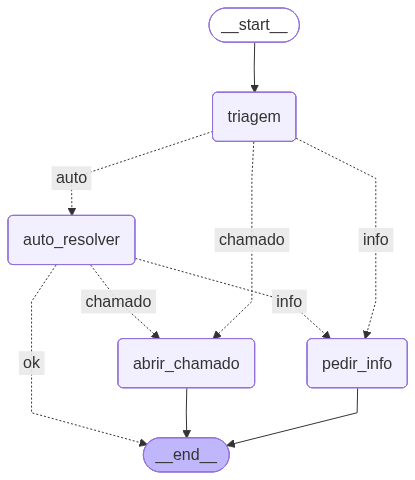

# 🤖 Imersão Agentes de IA (Google Gemini + Alura)

Assistente interno que:
- Classifica solicitações (AUTO_RESOLVER / PEDIR_INFO / ABRIR_CHAMADO)
- Usa RAG sobre PDFs de políticas internas (FAISS + Embeddings Gemini)
- Responde com citações (documento, página, trecho)
- Orquestra lógica com LangGraph (grafo de estados)

---

## 🔄 Fluxo do Agente



---

## 🧱 Stack Principal

| Componente | Uso |
|------------|-----|
| Gemini (Chat + Embeddings) | Geração e vetorização |
| LangChain | Abstrações de LLM, retriever e chains |
| FAISS | Busca vetorial local |
| PyMuPDFLoader | Leitura de PDFs |
| LangGraph | Orquestração do fluxo (triagem → ações) |
| Pydantic | Saída estruturada (JSON da triagem) |

---

## 🚀 Execução Rápida

1. Clonar:
```bash
git clone https://github.com/xguimiranda/Imersao_Agentes_IA_Gemini.git
cd Imersao_Agentes_IA_Gemini
```

2. Instalar deps essenciais:
```bash
pip install langchain langchain-google-genai google-generativeai \
            langchain_community faiss-cpu langchain-text-splitters pymupdf \
            langgraph pydantic
```

3. API Key:
```bash
export GEMINI_API_KEY="SUA_CHAVE"
```

4. Colocar PDFs de políticas (ex.: reembolso, home office, e-mail) no diretório esperado (ex.: `/content/` no Colab ou adaptar caminho local).

5. Executar o notebook principal:
[Imersão_Agentes_de_Ia_Google_Gemini_+_Alura.ipynb](Imers%C3%A3o_Agentes_de_Ia_Google_Gemini_%2B_Alura.ipynb)

---

## 🧪 Exemplos

Triagem:
```
Entrada: "Quero mais 5 dias de trabalho remoto. Como faço?"
Saída: {"decisao":"ABRIR_CHAMADO","urgencia":"MEDIA","campos_faltantes":[]}
```

RAG:
```
Pergunta: "Posso reembolsar a internet?"
→ Resposta baseada no PDF + citações (documento / página / trecho)
```

Fallback:
- Sem contexto suficiente → "Não sei."
- Sem contexto + palavras-chave (exceção/liberação) → abre chamado
- Sem contexto e sem keywords → pede mais detalhes

---

## 🛠️ Estrutura Lógica (Resumida)

1. Triagem (LLM estruturado)  
2. Se AUTO_RESOLVER → RAG → (sucesso) responde / (falha) decide próximo passo  
3. Se PEDIR_INFO → retorna campos faltantes  
4. Se ABRIR_CHAMADO → mensagem de abertura  
5. Fim

---

Feito durante a imersão Alura + Gemini.  
Se curtiu, deixa uma ⭐ no repositório!
